# PRMS Database Schema

```mermaid
erDiagram

    users {
        bigint id PK
        string name
        string email UK
        string password
        string google_id
        text two_factor_secret
        timestamp two_factor_confirmed_at
        string theme
        boolean is_active
        timestamp email_verified_at
        timestamps created_at
        timestamps updated_at
    }

    sessions {
        string id PK
        bigint user_id FK
        string ip_address
        text user_agent
        int last_activity
    }

    modules {
        bigint id PK
        string name
        string slug UK
        string description
        string default_status
        bigint source_module_id FK
        boolean my_records_only
        int sort_order
        boolean has_submit_button
        boolean has_return_button
        boolean has_draft_button
        timestamps created_at
        timestamps updated_at
    }

    module_fields {
        bigint id PK
        bigint module_id FK
        string name
        string description
        string slug
        string type
        boolean is_required
        int sort_order
        boolean show_in_index
        tinyint col_span
        boolean versioning
        json options_json
        json visibility_conditions
        timestamps created_at
        timestamps updated_at
    }

    records {
        bigint id PK
        bigint module_id FK
        json data
        string status
        bigint current_stage_id FK
        timestamp stage_entered_at
        bigint assigned_to FK
        bigint created_by FK
        bigint updated_by FK
        timestamps created_at
        timestamps updated_at
    }

    record_comments {
        bigint id PK
        bigint record_id FK
        bigint user_id FK
        text body
        timestamps created_at
        timestamps updated_at
    }

    record_approvals {
        bigint id PK
        bigint record_id FK
        bigint stage_id FK
        bigint user_id FK
        string action
        text comment
        timestamps created_at
        timestamps updated_at
    }

    record_histories {
        bigint id PK
        bigint record_id FK
        bigint user_id FK
        string action
        json changes_json
        timestamps created_at
        timestamps updated_at
    }

    workflow_stages {
        bigint id PK
        bigint module_id FK
        string name
        smallint order
        bigint approver_role_id FK
        bigint reviewer_role_id FK
        boolean requires_all_approvers
        boolean is_final_approval
        boolean has_return_button
        string stage_type
        smallint auto_advance_days
        json branches_json
        json stage_fields_json
        json notify_on_enter_json
        json date_reminders_json
        boolean allow_edit
        string default_status
        timestamps created_at
        timestamps updated_at
    }

    workflow_stage_templates {
        bigint id PK
        string name
        json stages_json
        timestamps created_at
        timestamps updated_at
    }

    workflows {
        bigint id PK
        bigint module_id FK
        string name
        string trigger
        json conditions_json
        timestamps created_at
        timestamps updated_at
    }

    workflow_actions {
        bigint id PK
        bigint workflow_id FK
        string type
        json config_json
        timestamps created_at
        timestamps updated_at
    }

    webhooks {
        bigint id PK
        bigint module_id FK
        string name
        string url
        json events
        string secret
        boolean is_active
        timestamps created_at
        timestamps updated_at
    }

    webhook_logs {
        bigint id PK
        bigint webhook_id FK
        string event
        json payload
        int response_code
        text response_body
        boolean success
        timestamps created_at
        timestamps updated_at
    }

    text_editor_documents {
        bigint id PK
        bigint record_id FK
        string field_slug
        longtext binary_state
        timestamps created_at
        timestamps updated_at
    }

    text_editor_histories {
        bigint id PK
        bigint record_id FK
        string field_slug
        bigint user_id FK
        enum action
        text content
        timestamp created_at
    }

    text_editor_reviews {
        bigint id PK
        bigint record_id FK
        string field_slug
        bigint user_id FK
        timestamp reviewed_at
        timestamps created_at
        timestamps updated_at
    }

    text_editor_comments {
        bigint id PK
        bigint record_id FK
        string field_slug
        uuid comment_id UK
        bigint user_id FK
        string quoted_text
        text body
        timestamp resolved_at
        timestamps created_at
        timestamps updated_at
    }

    permissions {
        bigint id PK
        string name
        string guard_name
        timestamps created_at
        timestamps updated_at
    }

    roles {
        bigint id PK
        string name
        string guard_name
        timestamps created_at
        timestamps updated_at
    }

    model_has_roles {
        bigint role_id FK
        string model_type
        bigint model_id FK
    }

    model_has_permissions {
        bigint permission_id FK
        string model_type
        bigint model_id FK
    }

    role_has_permissions {
        bigint permission_id FK
        bigint role_id FK
    }

    personal_access_tokens {
        bigint id PK
        string tokenable_type
        bigint tokenable_id
        string name
        string token UK
        text abilities
        timestamps created_at
        timestamps updated_at
    }

    notifications {
        uuid id PK
        string type
        string notifiable_type
        bigint notifiable_id
        text data
        timestamp read_at
        timestamps created_at
        timestamps updated_at
    }

    %% Core domain relationships
    users ||--o{ sessions : "has"
    users ||--o{ records : "creates (created_by)"
    users ||--o{ records : "updates (updated_by)"
    users ||--o{ records : "assigned to"
    users ||--o{ record_comments : "writes"
    users ||--o{ record_approvals : "makes"
    users ||--o{ record_histories : "authors"

    %% Module structure
    modules ||--o{ module_fields : "defines"
    modules ||--o{ records : "contains"
    modules ||--o{ workflow_stages : "has"
    modules ||--o{ workflows : "has"
    modules ||--o{ webhooks : "triggers"
    modules |o--o| modules : "mirrors (source_module_id)"

    %% Record lifecycle
    records ||--o{ record_comments : "has"
    records ||--o{ record_approvals : "has"
    records ||--o{ record_histories : "has"
    records }o--|| workflow_stages : "at stage (current_stage_id)"

    %% Workflow / approval
    workflow_stages }o--|| roles : "approver role"
    workflow_stages }o--o| roles : "reviewer role"
    record_approvals }o--|| workflow_stages : "for stage"

    %% Automation
    workflows ||--o{ workflow_actions : "has"

    %% Webhooks
    webhooks ||--o{ webhook_logs : "logs"

    %% Collaborative editor
    records ||--o{ text_editor_documents : "has"
    records ||--o{ text_editor_histories : "has"
    records ||--o{ text_editor_reviews : "has"
    records ||--o{ text_editor_comments : "has"
    users ||--o{ text_editor_histories : "authors"
    users ||--o{ text_editor_reviews : "marks"
    users ||--o{ text_editor_comments : "writes"

    %% Permissions (Spatie)
    roles ||--o{ role_has_permissions : "has"
    permissions ||--o{ role_has_permissions : "granted via"
    roles ||--o{ model_has_roles : "assigned via"
    permissions ||--o{ model_has_permissions : "assigned via"
```

## Column Notes

### `module_fields`
| Column | Notes |
|---|---|
| `show_in_index` | boolean — whether field appears in the record list table |
| `col_span` | tinyint 1–2 — grid column width in form layout |
| `versioning` | boolean — enables collaborative Tiptap editor for this field |

### `workflow_stages`
| Column | Notes |
|---|---|
| `approver_role_id` | role that can approve/forward/reject at this stage |
| `reviewer_role_id` | separate role for text-editor reviewing ("Mark Review Done") |
| `stage_type` | `approval` \| `review` \| `none` |
| `branches_json` | `[{label, stage_id}, ...]` — custom routing buttons |
| `stage_fields_json` | `[{name, slug, type, is_required, options_json}, ...]` — inline fields filled during review |
| `notify_on_enter_json` | notifications fired automatically when record enters this stage |
| `date_reminders_json` | scheduled reminders based on date fields in the record |

### `text_editor_*` tables
| Table | Purpose |
|---|---|
| `text_editor_documents` | Stores base64-encoded Yjs binary CRDT state per `(record_id, field_slug)` |
| `text_editor_histories` | Per-change log: insert/delete events with user + content |
| `text_editor_reviews` | Tracks "Review Done" marks per `(record_id, field_slug, user_id)` |
| `text_editor_comments` | Inline comments keyed by `comment_id` UUID (matches Tiptap mark attribute) |
