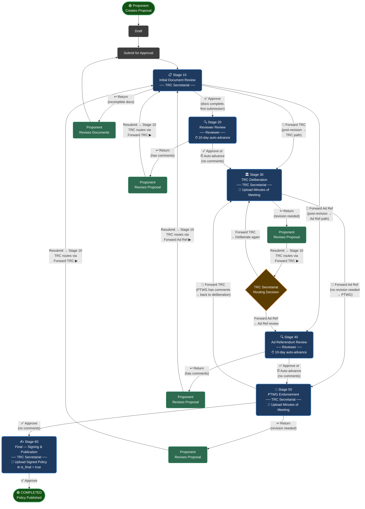

# Policy Proposals — Workflow Flowchart

---

## Path Summary

| Path | Steps |
|---|---|
| **Happy path** | Submit → S10 Approve → S20 Approve → S30 Forward Ad Ref → S50 Approve → S60 Approve → ✅ Completed |
| **Incomplete docs** | S10 Return → Revise → Resubmit → S10 |
| **Reviewer has comments** | S20 Return → Revise → S10 → Forward TRC → S30 |
| **TRC needs revision (TRC loop)** | S30 Return → Revise → S10 → Forward TRC → S30 |
| **TRC needs revision (Ad Ref)** | S30 Return → Revise → S10 → Forward Ad Ref → S40 → S50 |
| **PTWG has comments** | S50 Forward TRC → S30 → (continues from S30) |
| **Auto-advance (S20 / S40)** | No reviewer action in 10 working days → advances to next stage |

## Roles

| Role | Stages |
|---|---|
| **Proponent** | Creates, submits, revises |
| **TRC Secretariat** | S10, S30, S50, S60 — reviews, routes, deliberates, endorses |
| **Reviewer** | S20, S40 — provides comments, 10-day deadline |

# Steps on building the system stages

Step 1 — Create Roles /admin/roles

  Create three roles in order:
  1. Proponent
  2. TRC Secretariat
  3. Reviewer

  ---
  Step 2 — Create the Module /builder/modules/create

  Fill in:
  - Name: Policy Proposals
  - Default Status: Draft
  - Buttons: ✅ Submit, ✅ Draft, ✅ Return

  Add 8 fields:

  ┌────────────────────────┬─────────────────────────────────────────────────────┬──────────┐
  │          Name          │                        Type                         │ Required │
  ├────────────────────────┼─────────────────────────────────────────────────────┼──────────┤
  │ Title                  │ Text                                                │ ✅       │
  ├────────────────────────┼─────────────────────────────────────────────────────┼──────────┤
  │ Proposal Summary       │ Textarea                                            │ ✅       │
  ├────────────────────────┼─────────────────────────────────────────────────────┼──────────┤
  │ Proponent Organization │ Text                                                │ ✅       │
  ├────────────────────────┼─────────────────────────────────────────────────────┼──────────┤
  │ Policy Type            │ Select (Policy / Guidelines / Standards / Circular) │ ✅       │
  ├────────────────────────┼─────────────────────────────────────────────────────┼──────────┤
  │ Date Prepared          │ Date                                                │ ✅       │
  ├────────────────────────┼─────────────────────────────────────────────────────┼──────────┤
  │ Proposal Document      │ Attachment                                          │ ✅       │
  ├────────────────────────┼─────────────────────────────────────────────────────┼──────────┤
  │ Minutes of Meeting     │ Attachment                                          │ —        │
  ├────────────────────────┼─────────────────────────────────────────────────────┼──────────┤
  │ Revision Notes         │ Textarea                                            │ —        │
  └────────────────────────┴─────────────────────────────────────────────────────┴──────────┘

  ▎ Saving the module auto-creates all 7 permissions (view-, create-, edit-, delete-, change-status-, review-, approve-policy_proposals) —      
  nothing manual needed.

  ---
  Step 3 — Assign Permissions to Roles /admin/roles

  Edit each role and tick the permissions:

  ┌─────────────────┬────────────────────┐
  │      Role       │    Permissions     │
  ├─────────────────┼────────────────────┤
  │ Proponent       │ view, create, edit │
  ├─────────────────┼────────────────────┤
  │ TRC Secretariat │ all 7              │
  ├─────────────────┼────────────────────┤
  │ Reviewer        │ view, review       │
  └─────────────────┴────────────────────┘

  ---
  Step 4 — Create Workflow Stages /builder/workflow-stages/policy_proposals

  Create all 6 stages. Branches must be set after all stages exist (the dropdowns populate from existing stages):

  ┌───────┬───────────────────────────────┬─────────────────┬──────────┬──────────────┬────────────────┬────────────┐
  │ Order │             Name              │      Role       │   Type   │ Auto-advance │ Default Status │ Allow Edit │
  ├───────┼───────────────────────────────┼─────────────────┼──────────┼──────────────┼────────────────┼────────────┤
  │ 10    │ Initial Document Review       │ TRC Secretariat │ Approval │ —            │ Submitted      │ No         │
  ├───────┼───────────────────────────────┼─────────────────┼──────────┼──────────────┼────────────────┼────────────┤
  │ 20    │ Reviewer Review               │ Reviewer        │ Review   │ 10 days      │ Under Review   │ No         │
  ├───────┼───────────────────────────────┼─────────────────┼──────────┼──────────────┼────────────────┼────────────┤
  │ 30    │ TRC Deliberation              │ TRC Secretariat │ Approval │ —            │ Under Review   │ No         │
  ├───────┼───────────────────────────────┼─────────────────┼──────────┼──────────────┼────────────────┼────────────┤
  │ 40    │ Ad Referendum Review          │ Reviewer        │ Review   │ 10 days      │ Under Review   │ No         │
  ├───────┼───────────────────────────────┼─────────────────┼──────────┼──────────────┼────────────────┼────────────┤
  │ 50    │ PTWG Endorsement              │ TRC Secretariat │ Approval │ —            │ Under Review   │ No         │
  ├───────┼───────────────────────────────┼─────────────────┼──────────┼──────────────┼────────────────┼────────────┤
  │ 60    │ Final - Signing & Publication │ TRC Secretariat │ Approval │ ✅ Final     │ Completed      │ No         │
  └───────┴───────────────────────────────┴─────────────────┴──────────┴──────────────┴────────────────┴────────────┘

  Notes on new stage options:
  - **Default Status**: the status automatically applied to the record when it enters this stage. The final stage always sets Completed regardless.
  - **Allow Edit**: when disabled, the Edit button is hidden for records at this stage (even for users with edit permission). Useful for read-only review stages.

  Then edit each stage to set branches:

  ┌─────────────────────────┬─────────────────────────┬───────────────────┐
  │          Stage          │ Forward Ad Referendum → │ Forward for TRC → │
  ├─────────────────────────┼─────────────────────────┼───────────────────┤
  │ Initial Document Review │ Ad Referendum Review    │ TRC Deliberation  │
  ├─────────────────────────┼─────────────────────────┼───────────────────┤
  │ TRC Deliberation        │ PTWG Endorsement        │ —                 │
  ├─────────────────────────┼─────────────────────────┼───────────────────┤
  │ PTWG Endorsement        │ —                       │ TRC Deliberation  │
  └─────────────────────────┴─────────────────────────┴───────────────────┘

  ---
  Step 5 — Create Users /admin/users

  Create three demo users and assign roles:

  ┌──────────────────┬────────────────────────┬─────────────────┐
  │       Name       │         Email          │      Role       │
  ├──────────────────┼────────────────────────┼─────────────────┤
  │ Proponent User   │ proponent@prms.local   │ Proponent       │
  ├──────────────────┼────────────────────────┼─────────────────┤
  │ Secretariat User │ secretariat@prms.local │ TRC Secretariat │
  ├──────────────────┼────────────────────────┼─────────────────┤
  │ Reviewer User    │ reviewer@prms.local    │ Reviewer        │
  └──────────────────┴────────────────────────┴─────────────────┘

